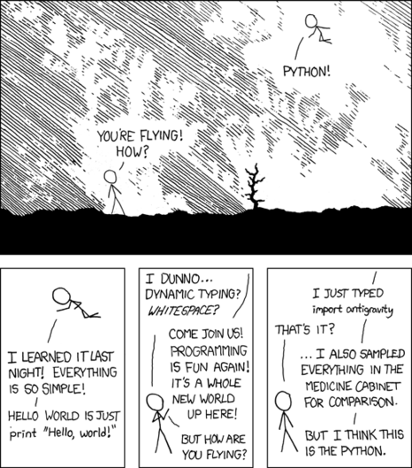
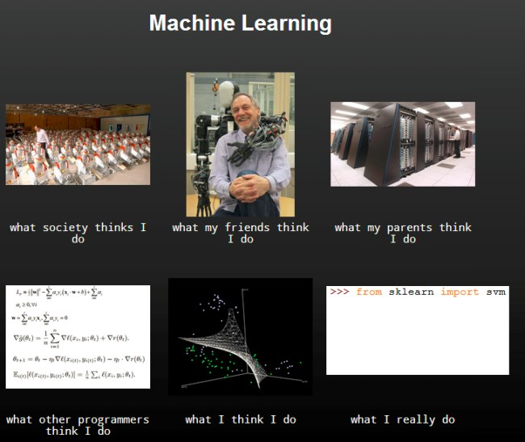

# Python etc

> Achilleas Koutsou

2019-08-29


Notes:

## Concepts

- Types, names, variables, objects.
    - Object identity and equality.
    - Mutability
    - Immutable types
    - Immutable containers which contain mutable objects.
- Namespaces.
    - Local scopes, global and nonlocal keywords.
- Classes.
    - Static methods, class methods.  Constructor, magic methods.

---


## Part 0

Why Python?

---

### Loved and wanted

- Highest *Wanted* language for 3 years in a row: It's the language most people want to learn (who don't know it already).
- 2nd highest *Loved* language.

*Source: Stack Overflow survey 2019: https://insights.stackoverflow.com/survey/2019*

---



<div class="smtext">
I wrote 20 short programs in Python yesterday. It was wonderful. Perl, I'm leaving you.
<p>Source: https://xkcd.com/353/ ([CC BY-NC 2.5](https://creativecommons.org/licenses/by-nc/2.5/))</p>
</div>

---

### *Batteries included*

A rich standard library means users can get started on projects without needing to download separate packages and rely on external dependencies.

---

### Computational science

- General scientific computing: Matplotlib, NumPy, SciPy, Jupyter, Pandas
- Machine learning: scikit-learn, TensorFlow
- Workflows and distributed processing: SnakeMake, Dask.

---



<div class="smtext">
Source: *The Internet* (i.e., unknown, i.e., I tried very hard to find the first appearance but couldn't)
</div>

---

## Part 1

Some basics

---


### 1.1 Definitions

**Objects**

Notes:
Let's talk about **objects**.  All data in Python is represented by **objects**.  Every object has an **identity**, a **type**, and a **value**.  **Objects** are (often) identified by a symbolic **name**.

---

#### Objects

```python
>>> greeting = "Hello"
```

- Identity: `id(hello)`
  - Equivalent to the memory address (in CPython)
- Type: `type(hello)`
  - `str` (string)
- Value: `10`
  - `print(greeting)`: string representation of a value

Notes:
Let's talk about **objects**.  All data in Python is represented by **objects**.  Every object has an **identity**, a **type**, and a **value**.  **Objects** are (often) identified by a symbolic **name**.

Note that both `id()` and `type()` are built-in introspection functions, but it's generally not recommended to use them in scripts and programs.

---

#### `id()`entity is important

- The `is` keyword compares object identity.
- `==` compares object value.

Notes:
Identity of objects is important and this will become clear later.

For now, keep in mind that `is` compares object identity, so it will return true when comparing two names that refer to the same object.

The double equality compares object values: It will return true when comparing two names that refer to objects with the same value.

---

#### `id()`entity is important

```python
>>> p = [1, 3, 5]
>>> q = p
>>> r = [1, 3, 5]
>>> p == q
True
>>> p == r
True
>>> r == q
True
>>> p is q
True
>>> p is r
False
>>> r is q
False
>>>
```

Notes:
A quick demonstration of why this matters:
- We assign a list of three integers to p
- We assign p to q
- and we assign the same list of three integers to r

And then we see that although all three lists are equal in **value**, only p and q refer to the same object, they have the same identity.

---

#### `id()`entity is important

```python
>>> p = [1, 3, 5]
>>> q = p
>>> r = [1, 3, 5]
>>> p.append(7)
>>> p
[1, 3, 5, 7]
>>> q
[1, 3, 5, 7]
>>> r
[1, 3, 5]
```

Notes:
And this can have implications for how a program behaves.  It's also a common gotcha for new Python users.

Appending a value to p modifies the underlying object, which means that q also points to the 4-value list but of course r remains intact.

It's easy to follow object identity when looking at examples like this, so this might not seem interesting, but we'll see how this can show up in unexpected places in a bit.

Note here that, in the Python interpreter, we can just type the name of a variable and it will output the value.  This is true of any expression.

---

> Assignments do not copy data — they just bind names to objects.

https://docs.python.org/3/tutorial/classes.html#a-word-about-names-and-objects

---

### 1.2 (Im)mutability

Immutable types: `int`, `float`, `str`, `tuple`

Mutable types: `list`, `dict`

Notes:
Objects in Python can be mutable or immutable.  This is a (non exhaustive, of course) list of types that are immutable and mutable.

---

### Immutable objects

```python
>>> greeting = "Hallo"
>>> greeting[1]
a
>>> greeting[1] = "e"
Traceback (most recent call last):
  File "<stdin>", line 1, in <module>
TypeError: 'str' object does not support item assignment
```

---

```python
greeting = "Hallo"
greeting = "Hello"
```

Notes:
Here, we're not changing the string, we're just binding (assigning) a new value (a different object) to the name `greeting`.  `greeting` refers to a different object now.

---

```python
>>> greeting = "Hallo"
>>> id(greeting)
4340894704
>>> greeting = "Hello"
>>> id(greeting)
4340894960
```

Notes:
"Hallo" and "Hello" are the values of two different objects (different IDs).  The name `greeting` can be freely bound to either.

---

```python
>>> x = "the number 10"
>>> x = 10
```

Notes:
In fact, a name can be freely bound to anything at any time.  It can be bound to values of different types in the same program.

This will not surprise anyone who's worked with a *dynamically typed* language before.

---

```python
>>> xstr = "The number 10"
>>> xint = 10
>>> xstr + xint
Traceback (most recent call last):
  File "<stdin>", line 1, in <module>
TypeError: can only concatenate str (not "int") to str
```

Notes:
In Python, **names** can have *dynamic types*, but an operation on 

---


---

```python
greeting += " there"
print(greeting)
greeting += ", old friend"
print(greeting)
```

These are convenient ways to change the value of a **name** that has type `str`.  The latter operation `+=` is more appropriate for numerical types.

```python
x = 10
x += 3
print(x)
```


What does it mean to be **immutable** then?


### The `id()`entity of an object

```python
greeting = "hello"
print(id(greeting))

greeting.append(" there")
print(id(greeting))
```

```python
x = 10
print(id(x))
x += 20
print(id(x))
```

The immutable object's **value** doesn't change, the names `greeting` and `x` are bound to different objects (they have a new `id`).


### Mutable objects

```python
days = ["Saturday", "Sunday"]
print(id(days))
days.append("Wednesday")
print(id(days))

days += ["Thursday", "Friday"]
print(id(days))
```

The name `days` is not rebound, it's still pointing to the same object.
The object's **value** has changed.  Lists are immutable.


### What this means in practice

In practice, you should always be aware of what you are doing to an object that is or is not mutable.

```python
weekend = ["Saturday", "Sunday"]
days = weekend
print(days)
days.append("Monday")
days.append("Tuesday")
days.append("Wednesday")
print(days)
print(weekend)
print(id(days), id(weekend))
```

When we assigned `weekend` to `days`, the existing object in `weekend` we *bound* to `days`.  Both `days` and `weekend` refer to the same object (they have the same `id`).  When we modified `days` we were modifying the underlying object that is bound to both names.

---

### Testing identities

```python
a = ["Green", "Yellow"]
b = ["Green", "Yellow"]
print(a == b)
print(a is b)

a.append("Red")
print(a)
print(b)

a = b
print(a is b)
```

---

> A special quirk of Python is that – if no global statement is in effect – assignments to names always go into the innermost scope.

https://docs.python.org/3/tutorial/classes.html#a-word-about-names-and-objects

